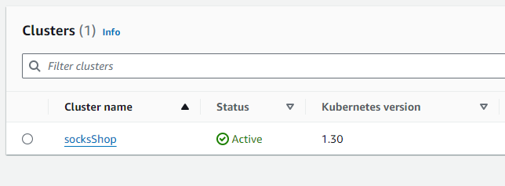
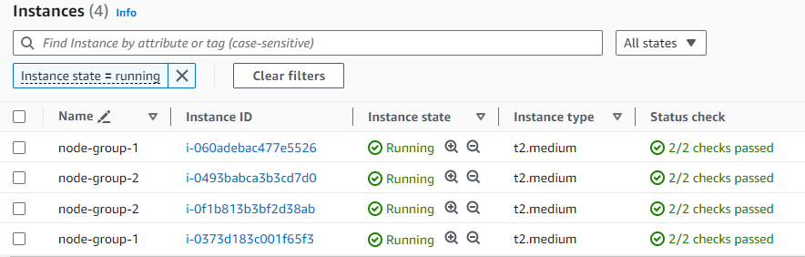
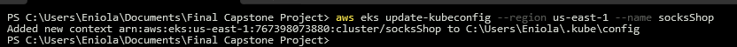
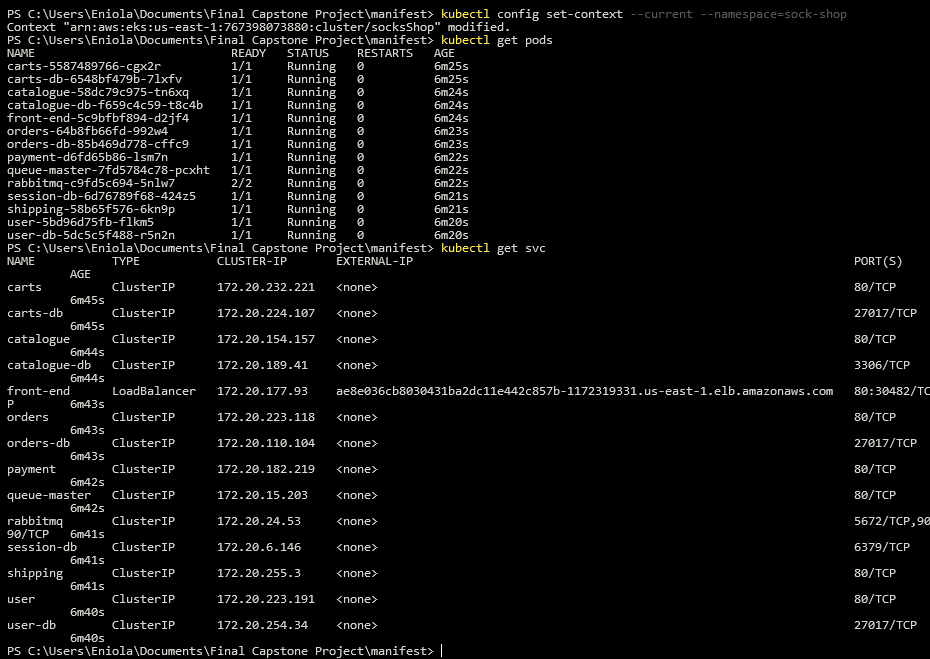
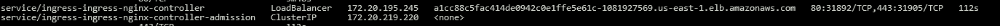
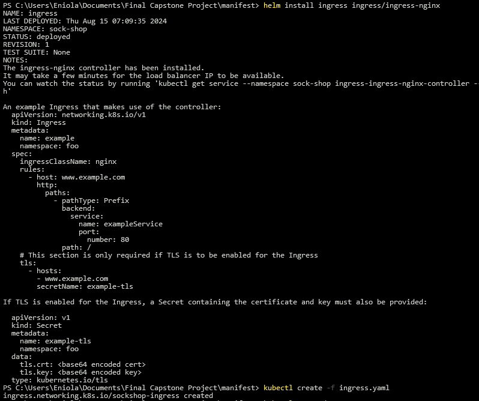
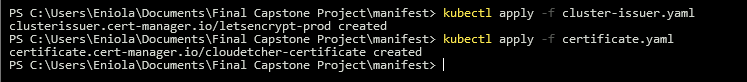

Here's a more readable version of the first README file, using the second README as a reference:

# Deploy the Sock-shop Microservice on Kubernetes Cluster

## Project Overview

This project involves deploying the Sock-shop microservices-based e-commerce application on a Kubernetes cluster using an Infrastructure as Code (IaC) approach. The deployment includes provisioning necessary infrastructure resources on AWS, setting up a deployment pipeline, implementing monitoring and logging solutions, and securing the infrastructure.

## Project Expectations

1. Deploy pipeline
2. Metrics (Alertmanager)
3. Monitoring (Grafana)
4. Logging (Prometheus)
5. Use Prometheus as a monitoring tool
6. Use Ansible or Terraform as the configuration management tool
7. Use an IaaS provider of your choice
8. Run the application on Kubernetes
9. Run the application on HTTPS with a Let's Encrypt certificate

## Requirements

* AWS account
* Code Editor
* Dependencies: AWS CLI, kubectl, Helm (package manager for Kubernetes), and Terraform
* Github Actions for CI/CD

## Deployment Steps

### 1. Initialize Terraform and Set Up Kubernetes Cluster on AWS

Initialize Terraform in your root directory, then run `terraform plan` and `terraform apply` to set up your Kubernetes cluster on AWS.





### 2. Update Kubeconfig

After cluster creation, update your kubeconfig:

```bash
aws eks --region <region> update-kubeconfig --name <cluster_name>
```



### 3. Deploy the Application

Deploy the application using the provided deployment YAML file.


### 4. Confirm Application Status

Use `kubectl get pods,svc -n sock-shop` to list all available pods and services in the sock-shop namespace.



### 5. Install Ingress Controller

Install the ingress controller using Helm:

```bash
helm repo add nginx https://helm.nginx.com/stable
helm repo update
helm install ingress nginx/nginx-ingress
```



### 6. Configure DNS Records

Create an "A record" in AWS Route 53 to map your ingress external IP address to your domain name. Also, create "CNAME" records for different pods.


### 7. Apply Ingress Rule

Apply the ingress rule:

```bash
kubectl apply -f main-ingress.yaml
```



### 8. Access Application (HTTP)

Access the application on your browser. It will render the Sock-shop app but show "Not Secured."


### 9. Install Cert-Manager and Request Let's Encrypt Certificate

Install Cert-Manager using Helm:

```bash
helm repo add jetstack https://charts.jetstack.io --force-update
kubectl apply -f https://github.com/cert-manager/cert-manager/releases/download/v1.15.2/cert-manager.yaml
```



### 10. Apply Let's Encrypt Certificate

Create and apply the Issuer or ClusterIssuer configuration and the certificate YAML file:

```bash
kubectl apply -f issuer.yaml
kubectl apply -f certificate.yaml
```


### 11. Test HTTPS

Confirm that your site is now secured with HTTPS.


### 12. Install Prometheus for Monitoring

Use Helm to install the Prometheus stack:

```bash
helm repo add prometheus-community https://prometheus-community.github.io/helm-charts
helm install prome prometheus-community/kube-prometheus-stack -n sock-shop
```


### 13. Access Grafana Dashboard

Retrieve the default Grafana credentials:

```bash
kubectl get secret prometheus-grafana -n sock-shop -o jsonpath="{.data.admin-user}" | base64 --decode
kubectl get secret prometheus-grafana -n sock-shop -o jsonpath="{.data.admin-password}" | base64 --decode
```


### 14. Access Prometheus Dashboard

Launch Prometheus on your browser (no credentials required).


### 15. Configure Alerting with Slack

Set up an alerting rule in Grafana to send notifications via Slack using a webhook.

Got free tier alerts from AWS. Applied for some credits from AWS and will update this repository.

## Conclusion

This project demonstrates the deployment of a microservices-based application on Kubernetes using Infrastructure as Code principles. It covers various aspects of modern cloud-native development, including container orchestration, monitoring, logging, and security.